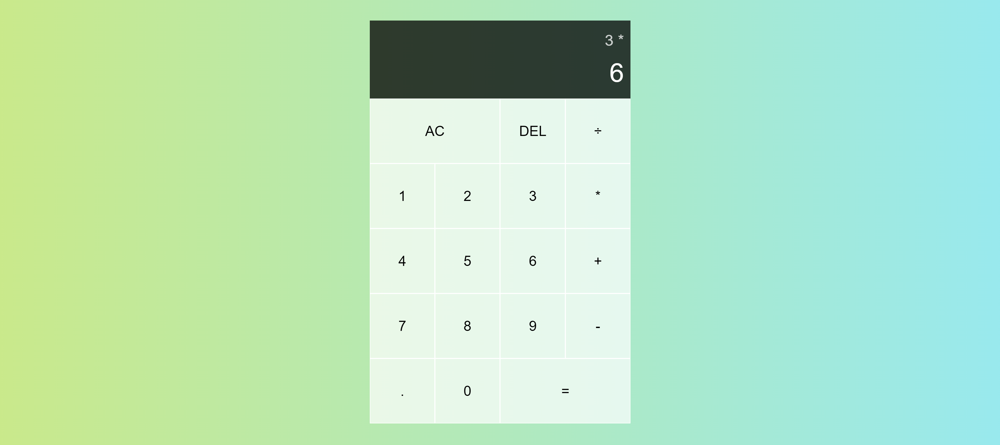

# Simple Calculator

A Simple Caluculator built with HTML, CSS, JavaScript.

## Contents
- Demo
- Features
- Technologies Used

## Demo
**Sample Output**

**Try it out :** [Live Demo](https://simple-calculator-nk.netlify.app/)

## Features
- Basic arithmetic operations: addition, subtraction, multiplication, division
- Clear and delete functionality

## Technologies Used
- HTML
- CSS
- JavaScript
